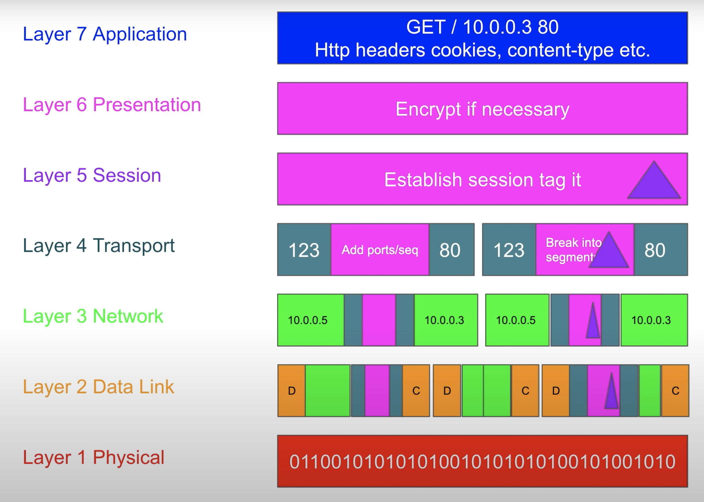
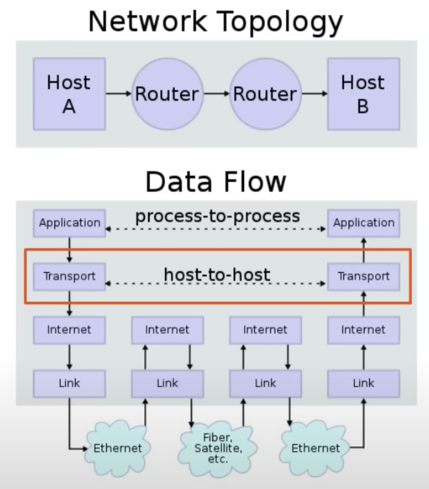

# Network

## ISO/OSI



## TCP/IP



## TCP/UDP

TCP (Transmission Control Protocol) and UDP (User Datagram Protocol) are both protocols used for transmitting data over the internet. Here are the main differences between them:

* Reliability: TCP is a reliable protocol that ensures that all data packets are delivered to the destination in the correct order. If any packet is lost or damaged during transmission, TCP retransmits it until it is successfully delivered. UDP, on the other hand, is an unreliable protocol that does not guarantee delivery of packets or their order.

* Connection-oriented vs connectionless: TCP is a connection-oriented protocol, which means that a connection is established between the sender and receiver before any data is transmitted. UDP is a connectionless protocol, which means that data can be sent to any receiver without establishing a connection first.

* Speed: UDP is faster than TCP because it does not perform the error-checking and retransmission of lost packets that TCP does. This makes it ideal for applications that require real-time data transmission, such as online gaming or streaming video.

* Packet size: TCP has a larger packet size than UDP, which means that it is more suited for transmitting large amounts of data. UDP's smaller packet size makes it more efficient for sending small amounts of data.

* Applications: TCP is commonly used for applications that require reliable data transmission, such as email, file transfer, and web browsing. UDP is commonly used for applications that require fast, real-time data transmission, such as online gaming, video conferencing, and voice-over-IP (VoIP).

In summary, TCP is a reliable, connection-oriented protocol that is suited for transmitting large amounts of data, while UDP is a faster, connectionless protocol that is ideal for real-time applications that require speed over reliability.

### A TCP Service in GO

```golang
package main

import (
    "fmt"
    "net"
)

func main() {
    fmt.Println("Starting TCP server...")
    listener, err := net.Listen("tcp", ":12345") // Listening on port 12345
    if err != nil {
        fmt.Println("Error starting TCP server:", err)
        return
    }
    defer listener.Close()

    for {
        conn, err := listener.Accept() // Wait for new connection
        if err != nil {
            fmt.Println("Error accepting new connection:", err)
            continue
        }
        go handleConnection(conn) // Handle the new connection in a separate goroutine
    }
}

func handleConnection(conn net.Conn) {
    defer conn.Close()
    fmt.Println("New connection from:", conn.RemoteAddr())
    buf := make([]byte, 1024) // Create buffer for incoming data
    for {
        n, err := conn.Read(buf) // Read data from connection
        if err != nil {
            fmt.Println("Error reading data from connection:", err)
            return
        }
        fmt.Println("Received data:", string(buf[:n])) // Print the received data
    }
}
```

### A UDP service in GO

```golang
package main

import (
    "fmt"
    "net"
)

func main() {
    fmt.Println("Starting UDP server...")
    serverAddr, err := net.ResolveUDPAddr("udp", ":12345") // Listening on port 12345
    if err != nil {
        fmt.Println("Error resolving UDP address:", err)
        return
    }

    conn, err := net.ListenUDP("udp", serverAddr) // Listen for incoming UDP packets
    if err != nil {
        fmt.Println("Error listening for UDP packets:", err)
        return
    }
    defer conn.Close()

    buf := make([]byte, 1024) // Create buffer for incoming data
    for {
        n, addr, err := conn.ReadFromUDP(buf) // Read data from UDP packet
        if err != nil {
            fmt.Println("Error reading data from UDP packet:", err)
            continue
        }
        fmt.Println("Received data from", addr.String(), ":", string(buf[:n])) // Print the received data and client address
        // Process and respond to the received data here
    }
}
```

### Telnet

Telnet is a protocol used to connect to a remote computer or server using the command line interface. Here's how you can use Telnet:

```shell
telnet <hostname or IP address> <port>
```

If the Telnet session is successful, you will be prompted to enter a login name and password to access the remote computer or server.

Once you're logged in, you can use Telnet to run commands and interact with the remote computer or server as if you were physically connected to it.

To exit the Telnet session, type the following command:

```shell
exit
```

Note that Telnet is an unencrypted protocol and is not secure for transmitting sensitive information. If you need to transmit sensitive information, it's recommended to use a more secure protocol, such as SSH (Secure Shell).

### netcat

The nc (or netcat) command is a versatile networking tool that allows you to establish TCP/UDP connections, send and receive data over a network, and perform other network-related tasks. Here are some common use cases for the nc command:

* Establish a TCP connection:

```shell
nc <hostname or IP address> <port>
```

This will establish a TCP connection to the specified hostname or IP address on the specified port. You can then type commands or send data to the remote server.

* Send a file over a network:

```shell
nc <hostname or IP address> <port> < file
```

This will send the contents of a local file to the remote server over the specified port.

* Receive a file over a network:

```shell
nc -l <port> > file
```

This will listen on the specified port and save any incoming data to a local file.

* Port scanning:

```shell
nc -zv <hostname or IP address> <start port>-<end port>
```

This will scan the specified range of ports on the remote server and report which ports are open.

* Chat over a network:

```shell
nc -l <port>
```

On one terminal, run the above command to listen on the specified port. On another terminal, run the following command:

```shell
nc <hostname or IP address> <port>
```

This will establish a connection to the server, allowing you to send messages back and forth like a chat room.

## Ubuntu 22 static IP

```shell
vim /etc/netplan/00-installer-config.yaml
```

```yaml
network:
  version: 2
  renderer: networkd
  ethernets:
    enp0s3:
      dhcp4: no
      addresses: [192.168.0.118/24]
      routes:
        - to: 0.0.0.0/0
          via: 192.168.0.1
      nameservers:
        addresses: [8.8.8.8, 8.8.4.4]
```

In this example, we set the IP address to 192.168.0.118, the subnet mask to 24, and the default gateway to 192.168.0.1. We also set the DNS servers to 8.8.8.8 and 8.8.4.4.

After editing the configuration file, save it and apply the changes by running:

```shell
sudo netplan apply
ip addr show enp0s3
ip route show
```

You should see the static IP address and default route configured under the enp0s3 interface.

## IPtables

### my golang app for test

main.go

```golang
package main

import (
 "fmt"
 "log"
 "net"
 "net/http"
)

func main() {
 http.HandleFunc("/", func(writer http.ResponseWriter, request *http.Request) {
  writer.Write([]byte(getLocalIP()))
 })

 fmt.Printf("Starting server at port 8080\n")

 err := http.ListenAndServe(":8080", nil)
 if err != nil {
  log.Fatalln(err)
 }
 getLocalIP()
}

func getLocalIP() string {
 addrs, err := net.InterfaceAddrs()
 firstIP := "0.0.0.0"
 if err != nil {
  fmt.Println(err)
 }

 for _, address := range addrs {
  // check if the address is not a loopback address and is IPv4
  if ipnet, ok := address.(*net.IPNet); ok && !ipnet.IP.IsLoopback() && ipnet.IP.To4() != nil {
   firstIP = ipnet.IP.String()
   break
  }
 }
 return firstIP
}
```

Dockerfile

```dockerfile
# Use a smaller base image
FROM golang:alpine as builder

# Set the working directory inside the container
WORKDIR /app

# Copy the source code into the container
COPY . .

# Build the Go binary
RUN go build -o app .

# Use a smaller base image for the final image
FROM alpine:latest

# Copy only the necessary files into the final image
COPY --from=builder /app/app .

# Expose the port on which the server will run
EXPOSE 8080

# Start the server when the container starts
CMD ["./app"]
```

```shell
docker build -t myapp .
```

start.sh

```shell
docker run -d -p 8081:8080 --name=container1 myapp
docker run -d -p 8082:8080 --name=container2 myapp
docker run -d -p 8083:8080 --name=container3 myapp
```

### Concept

iptables is a command-line firewall utility that is used to configure the packet filtering rules of the Linux kernel's netfilter framework. It provides a flexible and powerful way to manage network traffic by allowing you to define rules to selectively block or allow incoming and outgoing traffic based on various criteria such as source and destination IP addresses, protocols, and ports.

With iptables, you can create rules that define how packets should be handled by the kernel's netfilter framework. These rules are organized into chains, which are sequences of rules that are applied in a specific order. There are three built-in chains: INPUT, FORWARD, and OUTPUT. The INPUT chain is used to handle incoming traffic, the OUTPUT chain is used to handle outgoing traffic, and the FORWARD chain is used to handle traffic that passes through the Linux server.

You can use iptables to do things like:

Block incoming connections to specific ports or IP addresses
Allow incoming connections to specific ports or IP addresses
Forward traffic from one network interface to another
Block outgoing connections to specific ports or IP addresses
Allow outgoing connections to specific ports or IP addresses
iptables is a powerful and flexible tool for managing network traffic, but it can also be complex and difficult to use correctly. It is important to thoroughly understand the syntax and semantics of iptables rules before making any changes to your system's firewall configuration.

### Tables

1) filter: This is the default table and is used to filter packets based on various criteria such as source and destination IP addresses, protocols, and ports. This table is used to enforce firewall policies.

2) nat: This table is used to manipulate packets that are destined for the local system or that are forwarded through the system. It is used to perform network address translation (NAT) and can be used to implement port forwarding, load balancing, and other similar functions.

3) mangle: This table is used to modify packet headers and options. It is typically used to implement quality of service (QoS) features and to perform advanced routing.

4) raw: This table is used to bypass connection tracking and is typically used for packets that need to be handled differently from regular network traffic.

### Chains

1) INPUT: This chain is used to handle incoming packets that are destined for the local system.

2) FORWARD: This chain is used to handle packets that are forwarded through the system.

3) OUTPUT: This chain is used to handle outgoing packets that originate from the local system.

4) PREROUTING: This chain is used to modify packets as soon as they arrive at the network interface. This chain is part of the nat table.

5) POSTROUTING: This chain is used to modify packets as they are leaving the network interface. This chain is part of the nat table.

### Target

In iptables, there are many possible targets that can be used in rules to specify what action should be taken when a packet matches that rule. The exact number of targets can depend on various factors, such as the version of iptables being used and any additional modules that have been loaded.

However, some common targets that are often used in iptables rules include:

* ACCEPT: Accept the packet and allow it through the firewall.
* DROP: Drop the packet silently without sending any response to the sender.
* REJECT: Reject the packet and send a response to the sender to inform them that the packet was rejected.
* LOG: Log the packet to the system log before taking any further action.
* DNAT: Change the destination IP address or port of the packet and send it to a different IP address or port.
* REDIRECT: This target is used to redirect incoming packets to a different port on the same machine.
* SNAT: Change the source IP address or port of the packet before sending it out.
These targets can be used in combination with different options and arguments to create customized iptables rules that meet your specific security needs.

### What is the difference between REDIRECT and DNAT?

REDIRECT and DNAT are both iptables targets that can be used to modify the destination address or port of incoming packets. However, they work in slightly different ways:

* REDIRECT: This target is used to redirect incoming packets to a different port on the same machine. When a packet matches a rule with REDIRECT, the destination address of the packet is changed to the IP address of the machine itself, and the destination port is changed to the port specified in the --to-port option.

* DNAT: This target is used to modify the destination address or port of incoming packets and send them to a different machine on the network. When a packet matches a rule with DNAT, the destination address of the packet is changed to the IP address specified in the --to-destination option, and the destination port is changed to the port specified in the --to-ports option.

In other words, REDIRECT redirects traffic to a port on the same machine, while DNAT forwards traffic to a different machine altogether.

For example, if you want to redirect incoming traffic on port 80 to port 8080 on the same machine, you could use REDIRECT:

```shell
iptables -t nat -A PREROUTING -p tcp --dport 80 -j REDIRECT --to-port 8080
```

But if you wanted to forward incoming traffic on port 80 to a different machine with IP address 192.168.1.100, you would use DNAT:

```shell
iptables -t nat -A PREROUTING -p tcp --dport 80 -j DNAT --to-destination 192.168.1.100:80
```

### Relationship between tables, chains, rules

In iptables, tables contain chains, and chains contain rules.

There are four built-in tables in iptables: filter, nat, mangle, and raw. Each table has its own specific purpose and set of built-in chains. For example, the filter table is used to filter packets based on various criteria such as source and destination IP addresses, protocols, and ports. The nat table is used to perform network address translation (NAT) and can be used to implement port forwarding, load balancing, and other similar functions.

Each chain has a specific purpose and is used to perform a particular set of actions on packets that match certain criteria. For example, the INPUT chain is used to handle incoming packets that are destined for the local system, while the OUTPUT chain is used to handle outgoing packets that originate from the local system.

Rules are added to chains to define how packets should be handled. Each rule consists of a set of criteria that packets must match and an action that should be taken if the packets match those criteria. For example, a rule in the INPUT chain might drop all packets that originate from a specific IP address, while a rule in the OUTPUT chain might allow all packets that are destined for a specific port.

Overall, the relationship between tables, chains, and rules in iptables is hierarchical, with tables containing chains, and chains containing rules.

### Turn on ip forward on ubuntu 22

```shell
vim /etc/sysctl.conf
# Uncomment the line that contains the following text:
# net.ipv4.ip_forward=1

# This will reload the system parameters from the sysctl.conf file.
sysctl -p

# To check if IP forwarding is enabled 
cat /proc/sys/net/ipv4/ip_forward
```

### Examples

#### Redirect requests to port 80 to port 8080

To redirect incoming requests to port 80 to port 8080 using iptables, you can use the PREROUTING chain in the nat table. Here's an example command:

```shell
sudo iptables -t nat -A PREROUTING -p tcp --dport 80 -j REDIRECT --to-port 8080
```

This command appends (-A) a rule to the PREROUTING chain in the nat table that matches incoming TCP packets (-p tcp) with a destination port of 80 (--dport 80) and redirects (-j REDIRECT) them to port 8080 (--to-port 8080).

Keep in mind that this rule will only redirect incoming traffic, so if you want to redirect outgoing traffic, you would need to use the OUTPUT chain instead of the PREROUTING chain. Additionally, this rule will not persist across reboots, so you may want to save your iptables rules to a file or use a tool like iptables-persistent to save them automatically.
